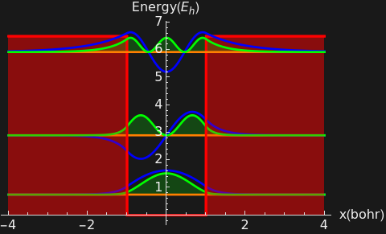
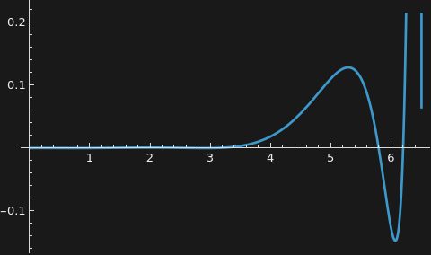
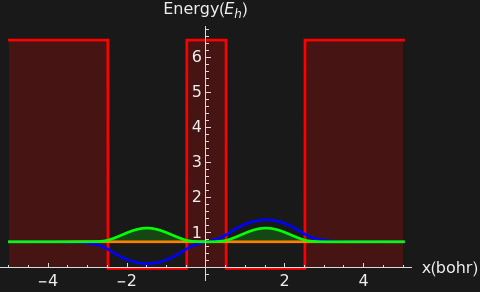
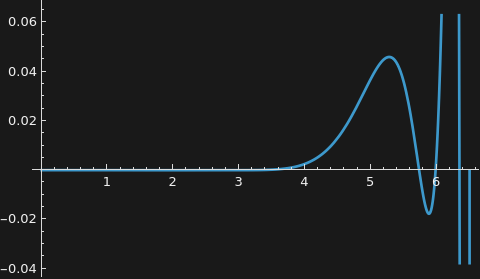
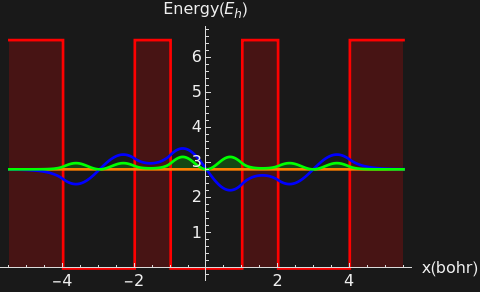

```wl
In[]:= \[AliasDelimiter]
```

```wl
In[]:= 
```

# Solving The Schrödinger Equation for Finite Potential: from atoms to molecules to solids

Authors: Angel Salazar 
School of Physical Sciences and Nanotechnology

### Single Finite Potential Well: model of a single atom

We want to solve the time independent Schrödinger equation:
$\frac{-\hbar ^2}{2m}$ $\frac{\partial ^2\psi (x)}{\partial x}$ V(x)ψ(x) = E ψ(x)

Let's define the finite potential.  use +pw+:


```wl
In[]:= Plot[v[x] /. {v0 -> vpot, a -> la}, {x, -la - 0.3, la + 0.3}, 
   AxesStyle -> {"x", "V(x)"}, 
   PlotStyle -> {Red, Thick}, 
   PlotRange -> {Automatic, {-0.2, vpot + 1.5}}, 
   AxesStyle -> Arrowheads[{0.0, 0.03}], 
   Filling -> Axis 
  ]
```


#### Solving the Schrödinger equation in a . u . 

In atomic units, ℏ -> 1, m -> 1, e -> 1; then the lengths are given in Bohr, 1bohr= 0.53 Å, and the energy in Hartree $E_h$ = 27.21 eV. 
Let's define α = $\sqrt{2(\text{v0} - \mathcal{E})}$, β = $\sqrt{2 \mathcal{E}}$,   (ℰ is +scE+)


Let's define the wavefunction  φ, φ is +j+:


```wl
In[]:= 
```

Now we need to consider the boundary conditions


```wl
In[]:= mat // MatrixForm
```

|  |  |  |  |
| - | - | - | - |
| -Power- | -Times- | -Sin- | 0 |
| -Times- | -Times- | -Times- | 0 |
| 0 | -Cos- | -Sin- | -Times- |
| 0 | -Times- | -Times- | -Times- |


```wl
In[]:= Plot[Det[mat2], {\[ScriptCapitalE], 0, vpot}]
```


```wl
In[]:= fig = Plot[Det[mat2], {\[ScriptCapitalE], 0, vpot}, PlotRange -> {-10^-20, 10^-20}]
```


```wl
In[]:= Short[fig, 5]
```


```wl
In[]:= fig[[1, 1, 1, 1, 1, 3, 1]][[2 ;; -1]]
```

```wl
Out[]= {Line[{{0.748476, 1.*10^-20}, {0.748476, -1.*10^-20}}], Line[{{2.9027, -1.*10^-20}, {2.9027, 1.*10^-20}}], Line[{{5.92702, 1.*10^-20}, {5.92702, -1.*10^-20}}]}
```

```wl
In[]:= approxroot1 = fig[[1, 1, 1, 1, 1, 3, 1]][[2 ;; -1]] // Map[#[[1, 1, 1]] &, #] & // Sort
```

```wl
Out[]= {0.748476, 2.9027, 5.92702}
```

```wl
In[]:= rval1 = approxroot1 // Map[FindRoot[Det[mat2], {\[ScriptCapitalE], #}] &, #] & // Map[\[ScriptCapitalE] /. # &, #] &
```

```wl
Out[]= {0.7495, 2.9032, 5.92714}
```

```wl
In[]:= fig[[1, 1, 1]]
```


```wl
In[]:= g = Normal[fig];  
   
  (*extract the x of every vertical line the plot drew (your zero crossings)*)
 aproxroot = Sort@Cases[g, Line[{{x_, y1_}, {x_, y2_}}] :> x, Infinity]
 
```

```wl
Out[]= {0.748476, 2.9027, 5.92702}
```

```wl
In[]:= rval = aproxroot // Map[FindRoot[Det[mat2], {\[ScriptCapitalE], #}] &, #] & // Map[\[ScriptCapitalE] /. # &, #] &
```

```wl
Out[]= {0.7495, 2.9032, 5.92714}
```

#### Level 1


```wl
Out[]= {0.705376, 0.0699299, 0, 0.705376}
```

We need to find the normalization constant for φ(x) , ∞


```wl
Out[]= 0.00633217
```


```wl
In[]:= 
```


```wl
Out[]= 1.
```

What is the probability of finding one electron when $x>\frac{a}{2}$?


```wl
Out[]= 0.0131291
```

Let' s find the Δx, then we need the expected value of 〈x〉 and $\left\langle x^2\right\rangle$


```wl
Out[]= 0
```


```wl
Out[]= 0.228641
```

Then the Δx is :


```wl
Out[]= 0.478165
```

Now let' s find the uncertainty in the momentum Δp :


```wl
Out[]= 0
```


```wl
Out[]= 1.15764
```

Then Δp is 


```wl
Out[]= 1.07594
```

Therefore the Heisengerg uncertainty Δx Δp is:

```wl
In[]:= \[CapitalDelta]x \[CapitalDelta]p
```

```wl
Out[]= 0.514476
```

What is the expected value of the kinetic energy k = $\frac{-\hbar ^2}{2m}$


```wl
Out[]= 0.578822
```

What is the expected potential energy for this level?


```wl
Out[]= 0.170678
```

Now, check this out: The total energy of the level


```wl
Out[]= 0.7495
```

```wl
In[]:= \[ScriptCapitalE] /. \[ScriptCapitalE] -> rval[[nval]]
```

```wl
Out[]= 0.7495
```

#### Level 2


```wl
Out[]= {-0.705261, 0, 0.0722025, 0.705261}
```

We need to find the normalization constant for φ(x) , ∞


```wl
Out[]= 0.00715691
```


```wl
In[]:= 
```


```wl
Out[]= 1.
```

What is the probability of finding one electron when $x>\frac{a}{2}$?


```wl
Out[]= 0.0606513
```

Let' s find the Δx, then we need the expected value of 〈x〉 and $\left\langle x^2\right\rangle$


```wl
Out[]= 0
```


```wl
Out[]= 0.548414
```

Then the Δx is :


```wl
Out[]= 0.74055
```

Now let' s find the uncertainty in the momentum Δp :


```wl
Out[]= 0
```


```wl
Out[]= 4.22948
```

Then Δp is 


```wl
Out[]= 2.05657
```

Therefore the Heisengerg uncertainty Δx Δp is:

```wl
In[]:= \[CapitalDelta]x \[CapitalDelta]p
```

```wl
Out[]= 1.52299
```

What is the expected value of the kinetic energy k = $\frac{-\hbar ^2}{2m}$


```wl
Out[]= 2.11474
```

What is the expected potential energy for this level?


```wl
Out[]= 0.788467
```

Now, check this out: The total energy of the level


```wl
Out[]= 2.9032
```

```wl
In[]:= \[ScriptCapitalE] /. \[ScriptCapitalE] -> rval[[nval]]
```

```wl
Out[]= 2.9032
```

#### Level 3


```wl
Out[]= {0.685361, -0.24609, 0, 0.685361}
```

We need to find the normalization constant for φ(x) , ∞


```wl
Out[]= 0.117138
```


```wl
In[]:= 
```


```wl
Out[]= 1.
```

What is the probability of finding one electron when $x>\frac{a}{2}$?


```wl
Out[]= 0.220218
```

Let' s find the Δx, then we need the expected value of 〈x〉 and $\left\langle x^2\right\rangle$


```wl
Out[]= 0
```


```wl
Out[]= 1.27519
```

Then the Δx is :


```wl
Out[]= 1.12924
```

Now let' s find the uncertainty in the momentum Δp :


```wl
Out[]= 0
```


```wl
Out[]= 6.12863
```

Then Δp is 


```wl
Out[]= 2.47561
```

Therefore the Heisengerg uncertainty Δx Δp is:

```wl
In[]:= \[CapitalDelta]x \[CapitalDelta]p
```

```wl
Out[]= 2.79556
```

What is the expected value of the kinetic energy k = $\frac{-\hbar ^2}{2m}$


```wl
Out[]= 3.06431
```

What is the expected potential energy for this level?


```wl
Out[]= 2.86283
```

Now, check this out: The total energy of the level


```wl
Out[]= 5.92714
```

```wl
In[]:= \[ScriptCapitalE] /. \[ScriptCapitalE] -> rval[[nval]]
```

```wl
Out[]= 5.92714
```

#### Summary of the plots

```wl
In[]:= Show @@ Table[figure[i], {i, 3}]
```



What is the total energy of the system if it has 3 E?

```wl
In[]:= 
```


```wl
Out[]= 4.40221
```


```wl
Out[]= 3.27238
```


```wl
Out[]= 1.12982
```

```wl
In[]:= 
```

### Two Finite Potential Well: model of a molecule

We want to solve the time independent Schrödinger equation:
$\frac{-\hbar ^2}{2m}$ $\frac{\partial ^2\psi (x)}{\partial x}$ V(x)ψ(x) = E ψ(x)

#### Define the potential

Let's define the finite potential.  use +pw+:


```wl
In[]:= Plot[v[x] /. {v0 -> vpot, a -> la, b -> lb}, {x, -la - lb - 0.3, la + la + 0.3}, 
   AxesStyle -> {"x", "V(x)"}, 
   PlotStyle -> {Red, Thick}, 
   PlotRange -> {Automatic, {-0.2, vpot + 1.5}}, 
   AxesStyle -> Arrowheads[{0.0, 0.03}], 
   Filling -> Axis 
  ]
```


#### Solving the Schrödinger equation in a . u . 

In atomic units, ℏ -> 1, m -> 1, e -> 1; then the lengths are given in Bohr, 1bohr= 0.53 Å, and the energy in Hartree $E_h$ = 27.21 eV. 
Let's define α = $\sqrt{2(\text{v0} - \mathcal{E})}$, β = $\sqrt{2 \mathcal{E}}$,   (ℰ is +scE+)


Let's define the wavefunction  φ, φ is +j+:


```wl
In[]:= 
```

Now we need to consider the boundary conditions


```wl
In[]:= mat // MatrixForm
```

|  |  |  |  |  |  |  |  |
| - | - | - | - | - | - | - | - |
| -Power- | -Times- | -Times- | 0 | 0 | 0 | 0 | 0 |
| -Times- | -Times- | -Times- | 0 | 0 | 0 | 0 | 0 |
| 0 | -Cos- | -Times- | -Times- | -Times- | 0 | 0 | 0 |
| 0 | -Times- | -Times- | -Times- | -Times- | 0 | 0 | 0 |
| 0 | 0 | 0 | -Power- | -Power- | -Times- | -Times- | 0 |
| 0 | 0 | 0 | -Times- | -Times- | -Times- | -Times- | 0 |
| 0 | 0 | 0 | 0 | 0 | -Cos- | -Sin- | -Times- |
| 0 | 0 | 0 | 0 | 0 | -Times- | -Times- | -Times- |


```wl
In[]:= Plot[Det[mat2], {\[ScriptCapitalE], 0, vpot}]
```



```wl
In[]:= fig = Plot[Det[mat2], {\[ScriptCapitalE], 0, vpot}, PlotRange -> {-10^-20, 10^-20}]
```


```wl
In[]:= fig[[1, 1, 1, 1, 1, 3, 1]][[2 ;; -1]]
```

```wl
Out[]= {Line[{{5.78811, 1.*10^-20}, {5.78811, -1.*10^-20}}], Line[{{0.739199, 1.*10^-20}, {0.739199, -1.*10^-20}}], Line[{{6.19469, -1.*10^-20}, {6.19469, 1.*10^-20}}], Line[{{0.7595, -1.*10^-20}, {0.7595, 1.*10^-20}}], Line[{{2.84476, 1.*10^-20}, {2.84476, -1.*10^-20}}], Line[{{2.96416, -1.*10^-20}, {2.96416, 1.*10^-20}}]}
```

```wl
In[]:= approxroot = fig[[1, 1, 1, 1, 1, 3, 1]][[2 ;; -1]] // Map[#[[1, 1, 1]] &, #] & // Sort
```

```wl
Out[]= {0.739199, 0.7595, 2.84476, 2.96416, 5.78811, 6.19469}
```

```wl
In[]:= rval = approxroot // Map[FindRoot[Det[mat2], {\[ScriptCapitalE], #}] &, #] & // Map[\[ScriptCapitalE] /. # &, #] &
```

```wl
Out[]= {0.739194, 0.759528, 2.84474, 2.96417, 5.78909, 6.19471}
```

```wl
In[]:= fig[[1, 1, 1]]
```


#### Level 1


```wl
Out[]= {0.707107, -0.000103738, -0.000420087, 0.0000274377, 0.0000274377, -0.000103738, 0.000420087, 0.707107}
```

We need to find the normalization constant for φ(x) , ∞


```wl
Out[]= 4.8918*10^-7
```


**Here we can see the bounding state** 

For this first energy level we can see that there is no nodes, since we have two atoms the energy level splits, it is forming a bounding level. This is the origin of the covalent bond which is related with the tunneling effect, since in the forbidden region is non zero, so the electron can be found with probabilities to be in the left region or right region. The blue line is the wave function. 

```wl
In[]:= 
```


```wl
Out[]= 1.
```

What is the probability of finding one electron when $x>a+\frac{b}{2}$?


```wl
Out[]= 0.166753
```

Let' s find the Δx, then we need the expected value of 〈x〉 and $\left\langle x^2\right\rangle$


```wl
Out[]= 1.00616*10^-10
```


```wl
Out[]= 2.44961
```

Then the Δx is :


```wl
Out[]= 1.56512
```

Now let' s find the uncertainty in the momentum Δp :


```wl
Out[]= 0
```


```wl
Out[]= 1.09625
```

Then Δp is 


```wl
Out[]= 1.04702
```

Therefore the Heisengerg uncertainty Δx Δp is:

```wl
In[]:= \[CapitalDelta]x \[CapitalDelta]p
```

```wl
Out[]= 1.63872
```

What is the expected value of the kinetic energy k = $\frac{-\hbar ^2}{2m}$


```wl
Out[]= 0.548126
```

What is the expected potential energy for this level?


```wl
Out[]= 0.191068
```

Now, check this out: The total energy of the level


```wl
Out[]= 0.739194
```

```wl
In[]:= \[ScriptCapitalE] /. \[ScriptCapitalE] -> rval[[nval]]
```

```wl
Out[]= 0.739194
```

#### Level 2


```wl
Out[]= {-0.707107, 0.000123297, 0.000415411, -0.0000265255, 0.0000265255, -0.000123297, 0.000415411, 0.707107}
```

We need to find the normalization constant for φ(x) , ∞


```wl
Out[]= 4.82117*10^-7
```




**Here we can see the bounding state** 

For this first energy level we can see that there is no nodes, since we have two atoms the energy level splits, it is forming a bounding level. This is the origin of the covalent bond which is related with the tunneling effect, since in the forbidden region is non zero, so the electron can be found with probabilities to be in the left region or right region. The blue line is the wave function. 

```wl
In[]:= 
```


```wl
Out[]= 1.
```

What is the probability of finding one electron when $x>a+\frac{b}{2}$?


```wl
Out[]= 0.15074
```

Let' s find the Δx, then we need the expected value of 〈x〉 and $\left\langle x^2\right\rangle$


```wl
Out[]= 1.32334*10^-10
```


```wl
Out[]= 2.50693
```

Then the Δx is :


```wl
Out[]= 1.58333
```

Now let' s find the uncertainty in the momentum Δp :


```wl
Out[]= 0
```


```wl
Out[]= 1.21675
```

Then Δp is 


```wl
Out[]= 1.10306
```

Therefore the Heisengerg uncertainty Δx Δp is:

```wl
In[]:= \[CapitalDelta]x \[CapitalDelta]p
```

```wl
Out[]= 1.74651
```

What is the expected value of the kinetic energy k = $\frac{-\hbar ^2}{2m}$


```wl
Out[]= 0.608376
```

What is the expected potential energy for this level?


```wl
Out[]= 0.151152
```

Now, check this out: The total energy of the level


```wl
Out[]= 0.759528
```

```wl
In[]:= \[ScriptCapitalE] /. \[ScriptCapitalE] -> rval[[nval]]
```

```wl
Out[]= 0.759528
```

#### Level 3


```wl
Out[]= {0.707106, 0.000486012, 0.00114043, -0.00021351, -0.00021351, 0.000486012, -0.00114043, 0.707106}
```

We need to find the normalization constant for φ(x) , ∞


```wl
Out[]= 4.30598*10^-6
```


**Here we can see the bounding state** 

For this first energy level we can see that there is no nodes, since we have two atoms the energy level splits, it is forming a bounding level. This is the origin of the covalent bond which is related with the tunneling effect, since in the forbidden region is non zero, so the electron can be found with probabilities to be in the left region or right region. The blue line is the wave function. 

```wl
In[]:= 
```


```wl
Out[]= 1.
```

What is the probability of finding one electron when $x>a+\frac{b}{2}$?


```wl
Out[]= 0.387518
```

Let' s find the Δx, then we need the expected value of 〈x〉 and $\left\langle x^2\right\rangle$


```wl
Out[]= 0
```


```wl
Out[]= 2.73146
```

Then the Δx is :


```wl
Out[]= 1.65271
```

Now let' s find the uncertainty in the momentum Δp :


```wl
Out[]= 0
```


```wl
Out[]= 3.90633
```

Then Δp is 


```wl
Out[]= 1.97644
```

Therefore the Heisengerg uncertainty Δx Δp is:

```wl
In[]:= \[CapitalDelta]x \[CapitalDelta]p
```

```wl
Out[]= 3.26649
```

What is the expected value of the kinetic energy k = $\frac{-\hbar ^2}{2m}$


```wl
Out[]= 1.95317
```

What is the expected potential energy for this level?


```wl
Out[]= 0.891571
```

Now, check this out: The total energy of the level


```wl
Out[]= 2.84474
```

```wl
In[]:= \[ScriptCapitalE] /. \[ScriptCapitalE] -> rval[[nval]]
```

```wl
Out[]= 2.84474
```

#### Level 4


```wl
Out[]= {-0.707105, -0.000704019, -0.00116066, 0.000240478, -0.000240478, 0.000704019, -0.00116066, 0.707105}
```

We need to find the normalization constant for φ(x) , ∞


```wl
Out[]= 4.94077*10^-6
```


**Here we can see the bounding state** 

For this first energy level we can see that there is no nodes, since we have two atoms the energy level splits, it is forming a bounding level. This is the origin of the covalent bond which is related with the tunneling effect, since in the forbidden region is non zero, so the electron can be found with probabilities to be in the left region or right region. The blue line is the wave function. 

```wl
In[]:= 
```


```wl
Out[]= 1.
```

What is the probability of finding one electron when $x>a+\frac{b}{2}$?


```wl
Out[]= 0.345875
```

Let' s find the Δx, then we need the expected value of 〈x〉 and $\left\langle x^2\right\rangle$


```wl
Out[]= 0
```


```wl
Out[]= 2.87706
```

Then the Δx is :


```wl
Out[]= 1.69619
```

Now let' s find the uncertainty in the momentum Δp :


```wl
Out[]= 0
```


```wl
Out[]= 4.58778
```

Then Δp is 


```wl
Out[]= 2.14191
```

Therefore the Heisengerg uncertainty Δx Δp is:

```wl
In[]:= \[CapitalDelta]x \[CapitalDelta]p
```

```wl
Out[]= 3.63309
```

What is the expected value of the kinetic energy k = $\frac{-\hbar ^2}{2m}$


```wl
Out[]= 2.29389
```

What is the expected potential energy for this level?


```wl
Out[]= 0.670283
```

Now, check this out: The total energy of the level


```wl
Out[]= 2.96417
```

```wl
In[]:= \[ScriptCapitalE] /. \[ScriptCapitalE] -> rval[[nval]]
```

```wl
Out[]= 2.96417
```

#### Level 5


```wl
Out[]= {0.705911, -0.0117825, -0.0360802, 0.0157672, 0.0157672, -0.0117825, 0.0360802, 0.705911}
```

We need to find the normalization constant for φ(x) , ∞


```wl
Out[]= 0.00528687
```


**Here we can see the bounding state** 

For this first energy level we can see that there is no nodes, since we have two atoms the energy level splits, it is forming a bounding level. This is the origin of the covalent bond which is related with the tunneling effect, since in the forbidden region is non zero, so the electron can be found with probabilities to be in the left region or right region. The blue line is the wave function. 

```wl
In[]:= 
```


```wl
Out[]= 1.
```

What is the probability of finding one electron when $x>a+\frac{b}{2}$?


```wl
Out[]= 0.367109
```

Let' s find the Δx, then we need the expected value of 〈x〉 and $\left\langle x^2\right\rangle$


```wl
Out[]= 0
```


```wl
Out[]= 3.37312
```

Then the Δx is :


```wl
Out[]= 1.83661
```

Now let' s find the uncertainty in the momentum Δp :


```wl
Out[]= 0
```


```wl
Out[]= 6.17611
```

Then Δp is 


```wl
Out[]= 2.48518
```

Therefore the Heisengerg uncertainty Δx Δp is:

```wl
In[]:= \[CapitalDelta]x \[CapitalDelta]p
```

```wl
Out[]= 4.56429
```

What is the expected value of the kinetic energy k = $\frac{-\hbar ^2}{2m}$


```wl
Out[]= 3.08805
```

What is the expected potential energy for this level?


```wl
Out[]= 2.70104
```

Now, check this out: The total energy of the level


```wl
Out[]= 5.78909
```

```wl
In[]:= \[ScriptCapitalE] /. \[ScriptCapitalE] -> rval[[nval]]
```

```wl
Out[]= 5.78909
```

#### Level 6


```wl
Out[]= {-0.691614, 0.0667736, 0.0750336, -0.10762, 0.10762, -0.0667736, 0.0750336, 0.691614}
```

We need to find the normalization constant for φ(x) , ∞


```wl
Out[]= 0.0367803
```


**Here we can see the bounding state** 

For this first energy level we can see that there is no nodes, since we have two atoms the energy level splits, it is forming a bounding level. This is the origin of the covalent bond which is related with the tunneling effect, since in the forbidden region is non zero, so the electron can be found with probabilities to be in the left region or right region. The blue line is the wave function. 

```wl
In[]:= 
```


```wl
Out[]= 1.
```

What is the probability of finding one electron when $x>a+\frac{b}{2}$?


```wl
Out[]= 0.262557
```

Let' s find the Δx, then we need the expected value of 〈x〉 and $\left\langle x^2\right\rangle$


```wl
Out[]= 0
```


```wl
Out[]= 4.99442
```

Then the Δx is :


```wl
Out[]= 2.23482
```

Now let' s find the uncertainty in the momentum Δp :


```wl
Out[]= 0
```


```wl
Out[]= 7.18132
```

Then Δp is 


```wl
Out[]= 2.6798
```

Therefore the Heisengerg uncertainty Δx Δp is:

```wl
In[]:= \[CapitalDelta]x \[CapitalDelta]p
```

```wl
Out[]= 5.98887
```

What is the expected value of the kinetic energy k = $\frac{-\hbar ^2}{2m}$


```wl
Out[]= 3.59066
```

What is the expected potential energy for this level?


```wl
Out[]= 2.60405
```

Now, check this out: The total energy of the level


```wl
Out[]= 6.19471
```

```wl
In[]:= \[ScriptCapitalE] /. \[ScriptCapitalE] -> rval[[nval]]
```

```wl
Out[]= 6.19471
```

#### Summary of the plots

```wl
In[]:= Show @@ Table[figure[i], {i, 6}]
```


What is the total energy of the system if it has 6 E?

```wl
In[]:= 
```

What is the total energy of the system if it has 6 E


```wl
Out[]= 8.68692
```

Kinetic energy of 6 E

```wl
In[]:= 
```


```wl
Out[]= 6.21933
```

```wl
In[]:=  
```

Total potential energy of 6 E


```wl
Out[]= 2.46758
```

#### Cohesion Energy

What is the cohesion energy for this 6 E system,  the cohesion energy is the energy needed to vaporize the system $E_{\text{cohesion} }= \frac{\text{Emol}}{2}-\text{Eatom}$.  What is the formation energy?


```wl
Out[]= -0.0587472
```

Now what would be the cohesion energy if each atom contributes with 4 E, then the molecule will have 8 E.


```wl
Out[]= 7.30541
```


```wl
Out[]= 14.6153
```


```wl
Out[]= 0.00222281
```

Here we notice that  the system evaporates because the cohesion energy is positive meaning that $E_{\text{atom}}$< $E_{\text{mol}}$ 

Now what would be the cohesion energy if each atom contributes with 5 E, then the molecule will have 10 electrons


```wl
Out[]= 13.2326
```


```wl
Out[]= 26.1935
```


```wl
Out[]= -0.135827
```

```wl
In[]:= 
```

Now we observe that the molecule is more stable. 

```wl
In[]:= 
```

### Three Finite Potential Well: model of a molecule

We want to solve the time independent Schrödinger equation:
$\frac{-\hbar ^2}{2m}$ $\frac{\partial ^2\psi (x)}{\partial x}$ V(x)ψ(x) = E ψ(x)

#### Define the potential

Let's define the finite potential.  use +pw+:


```wl
In[]:= Plot[v[x] /. {v0 -> vpot, a -> la, b -> lb}, {x, -2 la - lb - 0.3, +2 la + lb + 0.3}, 
   AxesStyle -> {"x", "V(x)"}, 
   PlotStyle -> {Red, Thick}, 
   PlotRange -> {Automatic, {-0.2, vpot + 1.5}}, 
   AxesStyle -> Arrowheads[{0.0, 0.03}], 
   Filling -> Axis 
  ]
```


#### Solving the Schrödinger equation in a . u . 

In atomic units, ℏ -> 1, m -> 1, e -> 1; then the lengths are given in Bohr, 1bohr= 0.53 Å, and the energy in Hartree $E_h$ = 27.21 eV. 
Let's define α = $\sqrt{2(\text{v0} - \mathcal{E})}$, β = $\sqrt{2 \mathcal{E}}$,   (ℰ is +scE+)


Let's define the wavefunction  φ, φ is +j+:


```wl
In[]:= 
```

Now we need to consider the boundary conditions


```wl
Out[]= {{E^((-a - 2 b) \[Alpha]), -Cos[(-a - 2 b) \[Beta]], -Sin[(-a - 2 b) \[Beta]], 0, 0, 0, 0, 0, 0, 0, 0, 0}, {E^((-a - 2 b) \[Alpha]) \[Alpha], \[Beta] Sin[(-a - 2 b) \[Beta]], -\[Beta] Cos[(-a - 2 b) \[Beta]], 0, 0, 0, 0, 0,0, 0, 0, 0}, {0, Cos[a \[Beta]], -Sin[a \[Beta]], -E^(a \[Alpha]), -E^(-a \[Alpha]), 0, 0, 0, 0, 0, 0, 0}, {0, \[Beta] Sin[a \[Beta]], \[Beta] Cos[a \[Beta]], E^(a \[Alpha]) \[Alpha], -E^(-a \[Alpha]) \[Alpha], 0, 0, 0, 0, 0, 0, 0}, {0, 0, 0, E^(b \[Alpha]), E^(-b \[Alpha]), -Cos[b \[Beta]], Sin[b \[Beta]], 0, 0, 0, 0, 0}, {0, 0, 0, -E^(b \[Alpha]) \[Alpha], E^(-b \[Alpha]) \[Alpha], -\[Beta] Sin[b \[Beta]], -\[Beta] Cos[b \[Beta]], 0, 0, 0, 0, 0}, {0, 0, 0, 0, 0, Cos[b \[Beta]], Sin[b \[Beta]], -E^(-b \[Alpha]), -E^(b \[Alpha]), 0, 0, 0}, {0, 0, 0, 0, 0, -\[Beta] Sin[b \[Beta]], \[Beta] Cos[b \[Beta]], E^(-b \[Alpha]) \[Alpha], -E^(b \[Alpha]) \[Alpha], 0, 0, 0}, {0, 0, 0, 0, 0, 0, 0, E^(-a \[Alpha]), E^(a \[Alpha]), -Cos[a \[Beta]], -Sin[a \[Beta]], 0}, {0, 0, 0, 0, 0, 0, 0, -E^(-a \[Alpha]) \[Alpha], E^(a \[Alpha]) \[Alpha], \[Beta] Sin[a \[Beta]], -\[Beta] Cos[a \[Beta]], 0}, {0, 0, 0, 0, 0, 0, 0, 0, 0, Cos[(a + 2 b) \[Beta]],Sin[(a + 2 b) \[Beta]], -E^-((a + 2 b) \[Alpha])}, {0, 0, 0, 0, 0, 0, 0, 0, 0, -\[Beta] Sin[(a + 2 b) \[Beta]], \[Beta] Cos[(a + 2 b) \[Beta]], E^-((a + 2 b) \[Alpha]) \[Alpha]}}
```

```wl
In[]:= mat // MatrixForm
```

|  |  |  |  |  |  |  |  |  |  |  |  |
| - | - | - | - | - | - | - | - | - | - | - | - |
| -Power- | -Times- | -Times- | 0 | 0 | 0 | 0 | 0 | 0 | 0 | 0 | 0 |
| -Times- | -Times- | -Times- | 0 | 0 | 0 | 0 | 0 | 0 | 0 | 0 | 0 |
| 0 | -Cos- | -Times- | -Times- | -Times- | 0 | 0 | 0 | 0 | 0 | 0 | 0 |
| 0 | -Times- | -Times- | -Times- | -Times- | 0 | 0 | 0 | 0 | 0 | 0 | 0 |
| 0 | 0 | 0 | -Power- | -Power- | -Times- | -Sin- | 0 | 0 | 0 | 0 | 0 |
| 0 | 0 | 0 | -Times- | -Times- | -Times- | -Times- | 0 | 0 | 0 | 0 | 0 |
| 0 | 0 | 0 | 0 | 0 | -Cos- | -Sin- | -Times- | -Times- | 0 | 0 | 0 |
| 0 | 0 | 0 | 0 | 0 | -Times- | -Times- | -Times- | -Times- | 0 | 0 | 0 |
| 0 | 0 | 0 | 0 | 0 | 0 | 0 | -Power- | -Power- | -Times- | -Times- | 0 |
| 0 | 0 | 0 | 0 | 0 | 0 | 0 | -Times- | -Times- | -Times- | -Times- | 0 |
| 0 | 0 | 0 | 0 | 0 | 0 | 0 | 0 | 0 | -Cos- | -Sin- | -Times- |
| 0 | 0 | 0 | 0 | 0 | 0 | 0 | 0 | 0 | -Times- | -Times- | -Times- |


```wl
In[]:= Plot[Det[mat2], {\[ScriptCapitalE], 0, vpot}]
```



```wl
In[]:= fig = Plot[Det[mat2], {\[ScriptCapitalE], 0, vpot}, PlotRange -> {-10^-20, 10^-20}]
```


```wl
In[]:= fig[[1, 1, 1, 1, 1, 3, 1]][[2 ;; -1]]
```

```wl
Out[]= {Line[{{5.73363, 1.*10^-20}, {5.73363, -1.*10^-20}}], Line[{{5.98363, -1.*10^-20}, {5.98363, 1.*10^-20}}], Line[{{2.90276, 1.*10^-20}, {2.90276, -1.*10^-20}}], Line[{{0.763652, 1.*10^-20}, {0.763652, -1.*10^-20}}], Line[{{6.34613, 1.*10^-20}, {6.34613, -1.*10^-20}}], Line[{{2.82144, -1.*10^-20}, {2.82144, 1.*10^-20}}], Line[{{2.99045, -1.*10^-20}, {2.99045, 1.*10^-20}}], Line[{{0.735003, 1.*10^-20}, {0.735003, -1.*10^-20}}], Line[{{0.749238, -1.*10^-20}, {0.749238, 1.*10^-20}}]}
```

```wl
In[]:= approxroot = fig[[1, 1, 1, 1, 1, 3, 1]][[2 ;; -1]] // Map[#[[1, 1, 1]] &, #] & // Sort
```

```wl
Out[]= {0.735003, 0.749238, 0.763652, 2.82144, 2.90276, 2.99045, 5.73363, 5.98363, 6.34613}
```

```wl
In[]:= rval = approxroot // Map[FindRoot[Det[mat2], {\[ScriptCapitalE], #}] &, #] & // Map[\[ScriptCapitalE] /. # &, #] &
```

```wl
Out[]= {0.734976, 0.749237, 0.76373, 2.82139, 2.90277, 2.99047, 5.73363, 5.98363, 6.34616}
```

```wl
In[]:= fig[[1, 1, 1]]
```


#### Level 1


```wl
Out[]= {0.707107, -2.35466*10^-6, 1.22653*10^-6, 1.04049*10^-9, 0.0000387152, 3.78837*10^-6, 0, 0.0000387152, 1.04049*10^-9, -2.35466*10^-6, -1.22652*10^-6, 0.707106}
```

We need to find the normalization constant for φ(x) , ∞


```wl
Out[]= 3.72987*10^-11
```


```wl
Out[]= 163739.
```


**Here we can see the bounding state** 

For this first energy level we can see that there is no nodes, since we have two atoms the energy level splits, it is forming a bounding level. This is the origin of the covalent bond which is related with the tunneling effect, since in the forbidden region is non zero, so the electron can be found with probabilities to be in the left region or right region. The blue line is the wave function. 

```wl
In[]:= 
```


```wl
Out[]= 1.
```

What is the probability of finding one electron when $x>a+\frac{b}{2}$?


```wl
Out[]= 0.489026
```

Let' s find the Δx, then we need the expected value of 〈x〉 and $\left\langle x^2\right\rangle$


```wl
Out[]= -2.60588*10^-6
```


```wl
Out[]= 4.64783
```

Then the Δx is :


```wl
Out[]= 2.15588
```

Now let' s find the uncertainty in the momentum Δp :


```wl
Out[]= 0. - 6.74607*10^-9 I
```


```wl
Out[]= 1.07139
```

Then Δp is 


```wl
Out[]= 1.03508 + 0. I
```

Therefore the Heisengerg uncertainty Δx Δp is:

```wl
In[]:= \[CapitalDelta]x \[CapitalDelta]p
```

```wl
Out[]= 2.23151 + 0. I
```

What is the expected value of the kinetic energy k = $\frac{-\hbar ^2}{2m}$


```wl
Out[]= 0.535694
```

What is the expected potential energy for this level?


```wl
Out[]= 0.199283
```

Now, check this out: The total energy of the level


```wl
Out[]= 0.734976
```

```wl
In[]:= \[ScriptCapitalE] /. \[ScriptCapitalE] -> rval[[nval]]
```

```wl
Out[]= 0.734976
```

#### Level 2


```wl
Out[]= {-0.707107, 2.3066*10^-6, -1.35301*10^-6, -1.02945*10^-9, -6.98887*10^-7, 0, 5.75311*10^-8, 6.9892*10^-7, 1.02945*10^-9, -2.3066*10^-6, -1.35301*10^-6, 0.707107}
```

We need to find the normalization constant for φ(x) , ∞


```wl
Out[]= 1.85273*10^-11
```


```wl
Out[]= 232324.
```


**Here we can see the bounding state** 

For this first energy level we can see that there is no nodes, since we have two atoms the energy level splits, it is forming a bounding level. This is the origin of the covalent bond which is related with the tunneling effect, since in the forbidden region is non zero, so the electron can be found with probabilities to be in the left region or right region. The blue line is the wave function. 

```wl
In[]:= 
```


```wl
Out[]= 1.
```

What is the probability of finding one electron when $x>a+\frac{b}{2}$?


```wl
Out[]= 0.00013201
```

Let' s find the Δx, then we need the expected value of 〈x〉 and $\left\langle x^2\right\rangle$


```wl
Out[]= 3.07691*10^-7
```


```wl
Out[]= 9.22532
```

Then the Δx is :


```wl
Out[]= 3.03732
```

Now let' s find the uncertainty in the momentum Δp :


```wl
Out[]= 0
```


```wl
Out[]= 1.15522
```

Then Δp is 


```wl
Out[]= 1.07481
```

Therefore the Heisengerg uncertainty Δx Δp is:

```wl
In[]:= \[CapitalDelta]x \[CapitalDelta]p
```

```wl
Out[]= 3.26455
```

What is the expected value of the kinetic energy k = $\frac{-\hbar ^2}{2m}$


```wl
Out[]= 0.577611
```

What is the expected potential energy for this level?


```wl
Out[]= 0.171626
```

Now, check this out: The total energy of the level


```wl
Out[]= 0.749237
```

```wl
In[]:= \[ScriptCapitalE] /. \[ScriptCapitalE] -> rval[[nval]]
```

```wl
Out[]= 0.749237
```

#### Level 3


```wl
Out[]= {0.707107, -2.25209*10^-6, 1.47904*10^-6, 1.01746*10^-9, -0.0000375897, -3.77483*10^-6, 0, -0.0000375897, 1.01746*10^-9, -2.25209*10^-6, -1.47904*10^-6, 0.707106}
```

We need to find the normalization constant for φ(x) , ∞


```wl
Out[]= 3.68009*10^-11
```


```wl
Out[]= 164843.
```


**Here we can see the bounding state** 

For this first energy level we can see that there is no nodes, since we have two atoms the energy level splits, it is forming a bounding level. This is the origin of the covalent bond which is related with the tunneling effect, since in the forbidden region is non zero, so the electron can be found with probabilities to be in the left region or right region. The blue line is the wave function. 

```wl
In[]:= 
```


```wl
Out[]= 1.
```

What is the probability of finding one electron when $x>a+\frac{b}{2}$?


```wl
Out[]= 0.484451
```

Let' s find the Δx, then we need the expected value of 〈x〉 and $\left\langle x^2\right\rangle$


```wl
Out[]= -1.914*10^-6
```


```wl
Out[]= 4.81129
```

Then the Δx is :


```wl
Out[]= 2.19346
```

Now let' s find the uncertainty in the momentum Δp :


```wl
Out[]= 0. + 3.89293*10^-9 I
```


```wl
Out[]= 1.24175
```

Then Δp is 


```wl
Out[]= 1.11434 + 0. I
```

Therefore the Heisengerg uncertainty Δx Δp is:

```wl
In[]:= \[CapitalDelta]x \[CapitalDelta]p
```

```wl
Out[]= 2.44426 + 0. I
```

What is the expected value of the kinetic energy k = $\frac{-\hbar ^2}{2m}$


```wl
Out[]= 0.620876
```

What is the expected potential energy for this level?


```wl
Out[]= 0.142854
```

Now, check this out: The total energy of the level


```wl
Out[]= 0.76373
```

```wl
In[]:= \[ScriptCapitalE] /. \[ScriptCapitalE] -> rval[[nval]]
```

```wl
Out[]= 0.76373
```

#### Level 4


```wl
Out[]= {-0.707107, 0.0000148909, 0.0000145698, 6.09589*10^-8, 0.000294205, 0, -0.0000294891, -0.000294205, -6.09589*10^-8, -0.0000148909, 0.0000145698, 0.707107}
```

We need to find the normalization constant for φ(x) , ∞


```wl
Out[]= 2.45375*10^-9
```


```wl
Out[]= 20187.6
```




**Here we can see the bounding state** 

For this first energy level we can see that there is no nodes, since we have two atoms the energy level splits, it is forming a bounding level. This is the origin of the covalent bond which is related with the tunneling effect, since in the forbidden region is non zero, so the electron can be found with probabilities to be in the left region or right region. The blue line is the wave function. 

```wl
In[]:= 
```


```wl
Out[]= 1.
```

What is the probability of finding one electron when $x>a+\frac{b}{2}$?


```wl
Out[]= 0.42894
```

Let' s find the Δx, then we need the expected value of 〈x〉 and $\left\langle x^2\right\rangle$


```wl
Out[]= 2.58958*10^-8
```


```wl
Out[]= 4.9508
```

Then the Δx is :


```wl
Out[]= 2.22504
```

Now let' s find the uncertainty in the momentum Δp :


```wl
Out[]= 0. + 2.68603*10^-10 I
```


```wl
Out[]= 3.78088
```

Then Δp is 


```wl
Out[]= 1.94445 + 0. I
```

Therefore the Heisengerg uncertainty Δx Δp is:

```wl
In[]:= \[CapitalDelta]x \[CapitalDelta]p
```

```wl
Out[]= 4.32647 + 0. I
```

What is the expected value of the kinetic energy k = $\frac{-\hbar ^2}{2m}$


```wl
Out[]= 1.89044
```

What is the expected potential energy for this level?


```wl
Out[]= 0.93095
```

Now, check this out: The total energy of the level


```wl
Out[]= 2.82139
```

```wl
In[]:= \[ScriptCapitalE] /. \[ScriptCapitalE] -> rval[[nval]]
```

```wl
Out[]= 2.82139
```

#### Level 5


```wl
Out[]= {0.707107, -0.0000187817, -0.0000135742, -7.24756*10^-8, -1.6508*10^-6, 1.57629*10^-6, 0, -1.6508*10^-6, -7.24756*10^-8, -0.0000187817, 0.0000135742, 0.707107}
```

We need to find the normalization constant for φ(x) , ∞


```wl
Out[]= 1.4765*10^-9
```


```wl
Out[]= 26024.6
```


**Here we can see the bounding state** 

For this first energy level we can see that there is no nodes, since we have two atoms the energy level splits, it is forming a bounding level. This is the origin of the covalent bond which is related with the tunneling effect, since in the forbidden region is non zero, so the electron can be found with probabilities to be in the left region or right region. The blue line is the wave function. 

```wl
In[]:= 
```


```wl
Out[]= 1.
```

What is the probability of finding one electron when $x>a+\frac{b}{2}$?


```wl
Out[]= 0.00133559
```

Let' s find the Δx, then we need the expected value of 〈x〉 and $\left\langle x^2\right\rangle$


```wl
Out[]= -2.69909*10^-9
```


```wl
Out[]= 9.53588
```

Then the Δx is :


```wl
Out[]= 3.08802
```

Now let' s find the uncertainty in the momentum Δp :


```wl
Out[]= 0
```


```wl
Out[]= 4.23045
```

Then Δp is 


```wl
Out[]= 2.05681
```

Therefore the Heisengerg uncertainty Δx Δp is:

```wl
In[]:= \[CapitalDelta]x \[CapitalDelta]p
```

```wl
Out[]= 6.35147
```

What is the expected value of the kinetic energy k = $\frac{-\hbar ^2}{2m}$


```wl
Out[]= 2.11523
```

What is the expected potential energy for this level?


```wl
Out[]= 0.787543
```

Now, check this out: The total energy of the level


```wl
Out[]= 2.90277
```

```wl
In[]:= \[ScriptCapitalE] /. \[ScriptCapitalE] -> rval[[nval]]
```

```wl
Out[]= 2.90277
```

#### Level 6


```wl
Out[]= {-0.707107, 0.0000232449, 0.0000117421, 8.71578*10^-8, -0.000349959, 0, 0.0000366659, 0.000349959, -8.71578*10^-8, -0.0000232449, 0.0000117421, 0.707107}
```

We need to find the normalization constant for φ(x) , ∞


```wl
Out[]= 3.58269*10^-9
```


```wl
Out[]= 16706.9
```


**Here we can see the bounding state** 

For this first energy level we can see that there is no nodes, since we have two atoms the energy level splits, it is forming a bounding level. This is the origin of the covalent bond which is related with the tunneling effect, since in the forbidden region is non zero, so the electron can be found with probabilities to be in the left region or right region. The blue line is the wave function. 

```wl
In[]:= 
```


```wl
Out[]= 1.
```

What is the probability of finding one electron when $x>a+\frac{b}{2}$?


```wl
Out[]= 0.450739
```

Let' s find the Δx, then we need the expected value of 〈x〉 and $\left\langle x^2\right\rangle$


```wl
Out[]= -5.26773*10^-9
```


```wl
Out[]= 5.18218
```

Then the Δx is :


```wl
Out[]= 2.27644
```

Now let' s find the uncertainty in the momentum Δp :


```wl
Out[]= 0. - 1.4165*10^-10 I
```


```wl
Out[]= 4.74773
```

Then Δp is 


```wl
Out[]= 2.17893 + 0. I
```

Therefore the Heisengerg uncertainty Δx Δp is:

```wl
In[]:= \[CapitalDelta]x \[CapitalDelta]p
```

```wl
Out[]= 4.9602 + 0. I
```

What is the expected value of the kinetic energy k = $\frac{-\hbar ^2}{2m}$


```wl
Out[]= 2.37386
```

What is the expected potential energy for this level?


```wl
Out[]= 0.616609
```

Now, check this out: The total energy of the level


```wl
Out[]= 2.99047
```

```wl
In[]:= \[ScriptCapitalE] /. \[ScriptCapitalE] -> rval[[nval]]
```

```wl
Out[]= 2.99047
```

#### Level 7


```wl
Out[]= {0.706805, 0.00430286, -0.00312713, 0.000306164, 0.0193428, -0.00686909, 0, 0.0193428, 0.000306164, 0.00430286, 0.00312713, 0.706805}
```

We need to find the normalization constant for φ(x) , ∞


```wl
Out[]= 0.000187818
```


```wl
Out[]= 72.9679
```


**Here we can see the bounding state** 

For this first energy level we can see that there is no nodes, since we have two atoms the energy level splits, it is forming a bounding level. This is the origin of the covalent bond which is related with the tunneling effect, since in the forbidden region is non zero, so the electron can be found with probabilities to be in the left region or right region. The blue line is the wave function. 

```wl
In[]:= 
```


```wl
Out[]= 1.
```

What is the probability of finding one electron when $x>a+\frac{b}{2}$?


```wl
Out[]= 0.268665
```

Let' s find the Δx, then we need the expected value of 〈x〉 and $\left\langle x^2\right\rangle$


```wl
Out[]= 0
```


```wl
Out[]= 5.94924
```

Then the Δx is :


```wl
Out[]= 2.43911
```

Now let' s find the uncertainty in the momentum Δp :


```wl
Out[]= 0
```


```wl
Out[]= 6.14248
```

Then Δp is 


```wl
Out[]= 2.4784
```

Therefore the Heisengerg uncertainty Δx Δp is:

```wl
In[]:= \[CapitalDelta]x \[CapitalDelta]p
```

```wl
Out[]= 6.04509
```

What is the expected value of the kinetic energy k = $\frac{-\hbar ^2}{2m}$


```wl
Out[]= 3.07124
```

What is the expected potential energy for this level?


```wl
Out[]= 2.66239
```

Now, check this out: The total energy of the level


```wl
Out[]= 5.73363
```

```wl
In[]:= \[ScriptCapitalE] /. \[ScriptCapitalE] -> rval[[nval]]
```

```wl
Out[]= 5.73363
```

#### Level 8


```wl
Out[]= {-0.706904, -0.00698728, 0.0105403, -0.0017447, 0.0109703, 0, -0.00271858, -0.0109703, 0.0017447, 0.00698728, 0.0105403, 0.706904}
```

We need to find the normalization constant for φ(x) , ∞


```wl
Out[]= 0.000587414
```


```wl
Out[]= 41.2599
```


**Here we can see the bounding state** 

For this first energy level we can see that there is no nodes, since we have two atoms the energy level splits, it is forming a bounding level. This is the origin of the covalent bond which is related with the tunneling effect, since in the forbidden region is non zero, so the electron can be found with probabilities to be in the left region or right region. The blue line is the wave function. 

```wl
In[]:= 
```


```wl
Out[]= 1.
```

What is the probability of finding one electron when $x>a+\frac{b}{2}$?


```wl
Out[]= 0.0115022
```

Let' s find the Δx, then we need the expected value of 〈x〉 and $\left\langle x^2\right\rangle$


```wl
Out[]= 0
```


```wl
Out[]= 11.048
```

Then the Δx is :


```wl
Out[]= 3.32386
```

Now let' s find the uncertainty in the momentum Δp :


```wl
Out[]= 0
```


```wl
Out[]= 6.80117
```

Then Δp is 


```wl
Out[]= 2.60791
```

Therefore the Heisengerg uncertainty Δx Δp is:

```wl
In[]:= \[CapitalDelta]x \[CapitalDelta]p
```

```wl
Out[]= 8.66831
```

What is the expected value of the kinetic energy k = $\frac{-\hbar ^2}{2m}$


```wl
Out[]= 3.40059
```

What is the expected potential energy for this level?


```wl
Out[]= 2.58307
```

Now, check this out: The total energy of the level


```wl
Out[]= 5.98366
```

```wl
In[]:= \[ScriptCapitalE] /. \[ScriptCapitalE] -> rval[[nval]]
```

```wl
Out[]= 5.98363
```

#### Level 9


```wl
Out[]= {0.610895, 0.00276313, -0.067175, 0.0537556, -0.33678, 0.109335, 0, -0.33678, 0.0537556, 0.00276313, 0.067175, 0.610895}
```

We need to find the normalization constant for φ(x) , ∞


```wl
Out[]= 0.0359037
```


```wl
Out[]= 5.27753
```


**Here we can see the bounding state** 

For this first energy level we can see that there is no nodes, since we have two atoms the energy level splits, it is forming a bounding level. This is the origin of the covalent bond which is related with the tunneling effect, since in the forbidden region is non zero, so the electron can be found with probabilities to be in the left region or right region. The blue line is the wave function. 

```wl
In[]:= 
```


```wl
Out[]= 1.
```

What is the probability of finding one electron when $x>a+\frac{b}{2}$?


```wl
Out[]= 0.36781
```

Let' s find the Δx, then we need the expected value of 〈x〉 and $\left\langle x^2\right\rangle$


```wl
Out[]= 0
```


```wl
Out[]= 8.40386
```

Then the Δx is :


```wl
Out[]= 2.89894
```

Now let' s find the uncertainty in the momentum Δp :


```wl
Out[]= 0
```


```wl
Out[]= 8.04229
```

Then Δp is 


```wl
Out[]= 2.83589
```

Therefore the Heisengerg uncertainty Δx Δp is:

```wl
In[]:= \[CapitalDelta]x \[CapitalDelta]p
```

```wl
Out[]= 8.22109
```

What is the expected value of the kinetic energy k = $\frac{-\hbar ^2}{2m}$


```wl
Out[]= 4.02115
```

What is the expected potential energy for this level?


```wl
Out[]= 2.32501
```

Now, check this out: The total energy of the level


```wl
Out[]= 6.34616
```

```wl
In[]:= \[ScriptCapitalE] /. \[ScriptCapitalE] -> rval[[nval]]
```

```wl
Out[]= 6.34616
```

#### Summary of the plots

```wl
In[]:= Show @@ Table[figure[i], {i, 9}]
```


What is the total energy of the system if it has 6 E?

```wl
In[]:= 
```

What is the total energy of the system if it has 6 E


```wl
Out[]= 8.68692
```

Kinetic energy of 6 E

```wl
In[]:= 
```


```wl
Out[]= 6.21933
```

```wl
In[]:=  
```

Total potential energy of 6 E


```wl
Out[]= 2.46758
```

#### Cohesion Energy

What is the cohesion energy for this 6 E system,  the cohesion energy is the energy needed to vaporize the system $E_{\text{cohesion} }= \frac{\text{Emol}}{2}-\text{Eatom}$.  What is the formation energy?


```wl
Out[]= -0.0587472
```

Now what would be the cohesion energy if each atom contributes with 4 E, then the molecule will have 8 E.


```wl
Out[]= 7.30541
```


```wl
Out[]= 14.6153
```


```wl
Out[]= 0.00222281
```

Here we notice that  the system evaporates because the cohesion energy is positive meaning that $E_{\text{atom}}$< $E_{\text{mol}}$ 

Now what would be the cohesion energy if each atom contributes with 5 E, then the molecule will have 10 electrons


```wl
Out[]= 13.2326
```


```wl
Out[]= 26.1935
```


```wl
Out[]= -0.135827
```

```wl
In[]:= 
```

Now we observe that the molecule is more stable. 

```wl
In[]:= 
```